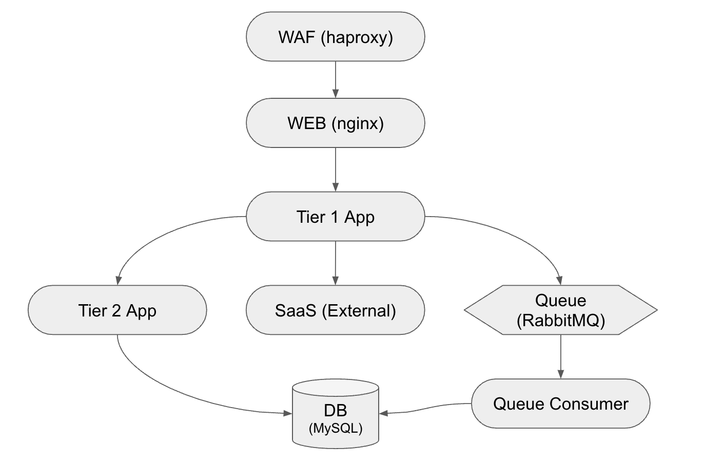
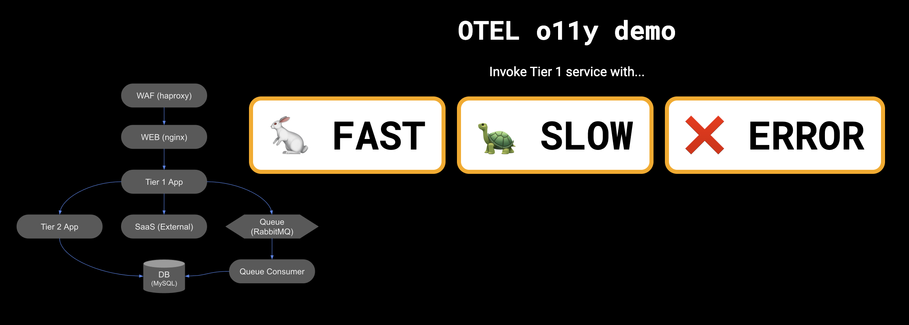
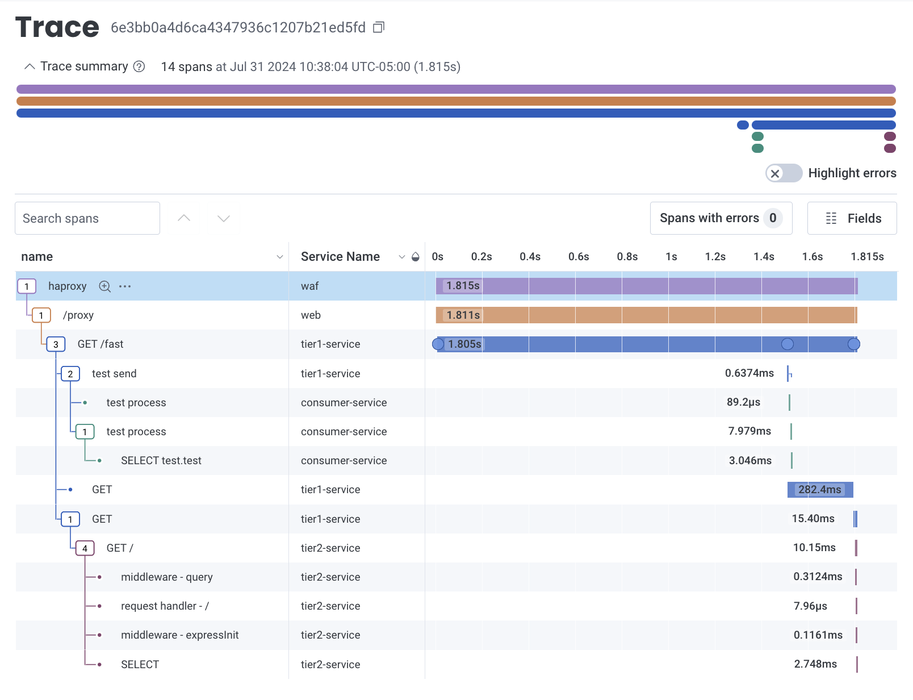

# OTEL Observability Demo

***This is a demo app, don't run it in production***

This contains a sample application for use in OpenTelemetry Demo. The application is consisted of the following components:


## Overview

OTEL Observability demo contains many common components of modern microservices architecture application that is consisted of 
- WAF : Web Application Firewall that acts as a gateway to the web application.
- WEB : WEB tier that has reverse proxy and web frontend to interact with user via web browser.
- Tier 1 App (Python) : Application that receives user request, and performs operations which involves 1) invoking external SaaS API 2) submitting request into Message Queue for processing.
- SaaS : Sample external API endpoint that will get invoked to retrieve sample data
- Queue : Message queue that enqueues the request and makes it available for Queue consumer
- Queue Consumer (Java Springboot) : application that waits for message queue and accesses database when the message is sent into queue by Tier 1.
- Database : Database that persists processed data to be made available for application
- Tier 2 App (Node.js) : Application that would get called by Tier 1 that will access database and return the result.
- OTEL collector : OpenTelemetry collector which acts as collecting agents for WAF and WEB layer.

Using this application as the base, you will be performing various instrumentation to extract telemetry data that will enable Honeycomb to receive those in metrics, logs, and traces, and then be able to provide the wholistic end-to-end investigation to debug the application when an incident occurs.

## Running the application

To run this app, you can use GitPod or Codespaces.

### GitHub Codespaces setup

Open the repository on GitHub. Open the `<> Code` dropdown down menu.

Select the `Codespaces` tab. Create a codespace on main.

### GitPod setup

Go to [Gitpod](https://gitpod.io/#https://github.com/honeycombio/otel-o11y-demo) to open the repository.

Confirm the workspace creation. You can work in the browser with VS Code Browser or in your local code editor. The default settings are acceptable. 

Once you are in the code editor, run `docker compose up` in the code editor's terminal. To stop running the application, run `ctrl+c`. Then run `docker compose down` to remove the container.

### Local development setup

You also have the option to run this application locally.

First, clone this repository.

```bash
git clone https://github.com/honeycombio/otel-o11y-demo.git
```

Install Docker: https://docs.docker.com/get-docker/

Update the `.env` file with your Honeycomb API key:
```bash
HONEYCOMB_API_KEY="your-api-key"

OTEL_EXPORTER_OTLP_ENDPOINT="https://api.honeycomb.io:443/"
OTEL_EXPORTER_OTLP_HEADERS="x-honeycomb-team=${HONEYCOMB_API_KEY}"
```

If you don't have an API key handy, here is the [documentation](https://docs.honeycomb.io/get-started/configure/environments/manage-api-keys/#create-api-key).


### Run the app

`./run`

(This will run `docker compose` in daemon mode, and build containers.)

Access the app:

[http://localhost:22022]()

After making changes to a service, you can tell it to rebuild just that one:

`./run [ waf | web | db | queue | otel-collector | queue-consumer | tier1 | tier2 ]`

### Try it out

Visit [http://localhost:22022]()

> If you are using **GitPod**, the address may not be localhost. When running, the VSC environment will ask you if you want to expose the ports to public. Select Yes, and you will see the external address and port 22022, to which you can then click the globe icon to show it on a new tab.



#### Using UI
Press either `FAST`, `SLOW`, `ERROR` button to request service calls that would run fast, slow, or cause error. Response will be shown, which describes how the call was handled, and their results.

### Stop the app

`./stop`

## Instrumenting the Application

This application is initially left to **NOT having any OTEL instrumentation** applied in its `main` branch, therefore not emitting any telemetry data to anywhere. The expectation is that readers of this repo would be able to follow individual instructions of how to instrumenting each layers of the application one by one to achieve the full OTEL instrumentation.

The fully instrumented application should be able to emit the trace looking similar to this:



Aside from the trace, there will be logs and metrics that would get emitted from number of different components. Please refer to the table below on how to apply OTEL instrumentation per each component.

|Component|Instrumentation instruction|Type of Telemetry|
|---|---|---|
|WAF|[README.md](./waf/README.md)|trace, log|
|WEB|[README.md](./web/README.md)|trace|
|Tier1|[README.md](./tier1-python/README.md)|trace|
|Tier2|[README.md](./tier2-nodejs/README.md)|trace|
|Consumer|[README.md](./consumer-java/README.md)|trace|
|DB|[README.md](./db/README.md)|metric|
|MQ|[README.md](./queue/README.md)|metric|
|OTEL collector|[README.md](./otel-collector/README.md)|trace, metric, log|

⚠️ **Note**
If you wish to view the fully instrumented version of the application, you can check out the `auto-instrumented` branch in this repo which will contain all the instrumentation mentioned in the above readme's implemented.

## Accessing the instrumented branch
If you want to skip applying OTEL instrumentation and take a look at fully instrumented version of this demo, you can check out the branch [auto-instrumented](https://github.com/honeycombio/otel-o11y-demo/tree/auto-instrumented) by running the following github command:

```
git clone git@github.com:honeycombio/otel-o11y-demo.git
git switch auto-instrumented
```

## Custom instrumenting the Application

In addition to the auto-instrumentation, there are cases where application needs to contain manual instrumentation such as any specific application related information that can greatly enhance the observability. There is a branch called `custom-instrumented` that is a sub-branch of `auto-instrumented` which contains all the examples of custom instrumation for the following services:

- tier1-python
- tier2-nodejs
- consumer-java
