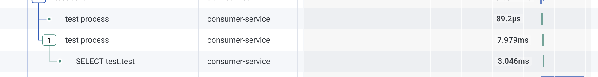

# Guide of instrumenting OTEL on consumer - Java

consumer is written in [Java](https://www.java.com/), and uses [Springboot](https://spring.io/projects/spring-boot) as web framework, and also uses [mysql](https://mvnrepository.com/artifact/mysql/mysql-connector-java) and [amqp](https://spring.io/projects/spring-amqp) to listen from the message queue in [rabbitMQ](https://www.rabbitmq.com/). The job of the consumer is to get triggered by the message published, and execute its work by communicating with the mysql database.

## Integration Strategy

The quckest way to instrument Java would be to use the [opentelemetry java agent](https://opentelemetry.io/docs/zero-code/java/agent/) available in from Opentelemetry. Java's auto-instrumentation is pretty mature and offers a quick and easy way to enable your application to start emitting traces without having to code much of integrations manually.

## Instrumentation Steps

1. In [Dockerfile](Dockerfile), add the wget command to download the `opentelemetry-javaagent.jar`, and copy the jar file to the directory where consumer.jar exists. Then, in the run CMD, add `-javaagent:./opentelemetry-javaagent.jar` along with the consumer.jar.

```
# Stage 1: Download dependencies
FROM maven:3.9.6-eclipse-temurin-21-jammy AS dependencies
WORKDIR /app
COPY pom.xml .
RUN mvn -B dependency:resolve dependency:resolve-plugins
RUN wget https://github.com/open-telemetry/opentelemetry-java-instrumentation/releases/download/v1.33.2/opentelemetry-javaagent.jar

# Stage 2: Build application
FROM dependencies AS build
COPY src ./src
RUN mvn -B package -DskipTests

# Stage 3: Final image
FROM eclipse-temurin:21-jdk-jammy
WORKDIR /app
COPY --from=build /app/target/consumer-0.0.1-SNAPSHOT.jar ./consumer.jar
COPY --from=dependencies /app/opentelemetry-javaagent.jar .
EXPOSE 8080
CMD ["java", "-javaagent:./opentelemetry-javaagent.jar", "-jar", "consumer.jar"]
```

2. In [docker-compose.yaml](../docker-compose.yaml), add the following environment variables to `queue_consumer` so that OTEL auto-instrumentation would know the service name, OTLP exporting endpoint (where to send the traces to), and required API key to be part of OTLP headers for authenticating into it.

```
  queue_consumer:
    build:
      context: ./consumer-java
      dockerfile: Dockerfile
    environment:
      - OTEL_SERVICE_NAME=consumer-service
      - OTEL_EXPORTER_OTLP_ENDPOINT=${OTEL_EXPORTER_OTLP_ENDPOINT}
      - OTEL_EXPORTER_OTLP_HEADERS=x-honeycomb-team=${HONEYCOMB_API_KEY}
    depends_on:
      queue:
        condition: service_healthy
      db:
        condition: service_healthy
```

## What this would look like



You should see the service name `consumer-service` that contains `test process` span which processes the message and then accesses database.

## Further readings

- [OpenTelemetry Concepts](https://opentelemetry.io/docs/concepts/) : Get yourself familiarized with various concepts of OpenTelemetry.
