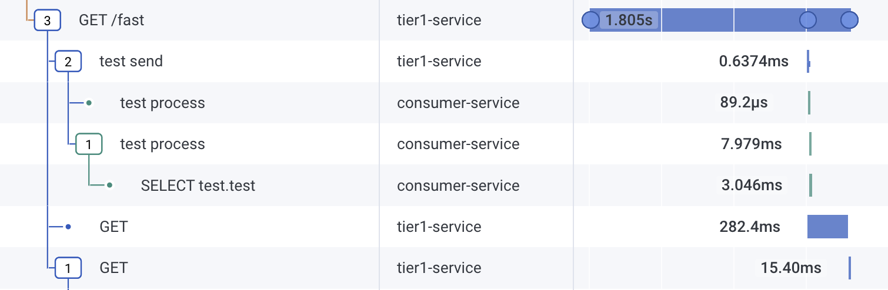

# Guide of instrumenting OTEL on Tier1 - Python

Tier 1 is written in [Python](https://www.python.org/), and uses [Flask](https://flask.palletsprojects.com/) as web framework, and also uses [pika](https://pika.readthedocs.io/en/stable/#) to queue message into [rabbitMQ](https://www.rabbitmq.com/).

## Integration Strategy

The quckest way to instrument Python would be to use the [python zero-code instrumentation](https://opentelemetry.io/docs/zero-code/python/) available in Opentelemetry.

## Instrumentation Steps

1. In [requirements.txt](requirements.txt), add the following entries which will install required opentelemetry libraries for python.

```
opentelemetry-distro
opentelemetry-exporter-otlp
```

2. In [Dockerfile](Dockerfile), add the following entry to `bootstrap` and setup `opentelemetry-instrument` script.

```
FROM docker.io/library/python:3.11.7-slim AS base

WORKDIR /app

COPY requirements.txt .

RUN apt-get -y update; apt-get -y install curl
RUN pip3 install -r requirements.txt
RUN opentelemetry-bootstrap --action=install
COPY app.py .

EXPOSE 8080

CMD opentelemetry-instrument \
    flask --app app run -p 8080 -h 0.0.0.0
```

3. In [docker-compose.yaml](../docker-compose.yaml), add the following environment variables to `tier1` so that OTEL auto-instrumentation would know the service name, OTLP exporting endpoint (where to send the traces to), and required API key to be part of OTLP headers for authenticating into it. Furthermore, notice how special `OTEL_PYTHON_LOG_CORRELATION` and `OTEL_PYTHON_LOGGING_AUTO_INSTRUMENTATION_ENABLED` is set, along with settings related to exporter's OTLP protocol. This is necessary so that the auto-instrumentation can attach python's logging to be automatically get the related trace id and span id, as well as be attached as span events instead of separate log messages.

```
  tier1:
    build:
      context: ./tier1-python
      dockerfile: Dockerfile
    image: tier1-python:latest
    environment:
      - OTEL_SERVICE_NAME=tier1-service
      - OTEL_EXPORTER_OTLP_PROTOCOL=http/protobuf
      - OTEL_TRACES_EXPORTER=console,otlp_proto_http
      - OTEL_LOGS_EXPORTER=otlp_proto_http
      - OTEL_PYTHON_LOG_CORRELATION=true
      - OTEL_PYTHON_LOGGING_AUTO_INSTRUMENTATION_ENABLED=true
      - OTEL_EXPORTER_OTLP_ENDPOINT=${OTEL_EXPORTER_OTLP_ENDPOINT}
      - OTEL_EXPORTER_OTLP_HEADERS=x-honeycomb-team=${HONEYCOMB_API_KEY}
    healthcheck:
      test: ["CMD-SHELL", "curl -f http://localhost:8080/healthcheck || exit 1"]
      interval: 10s
      timeout: 10s
      retries: 5
    ports: 
      - 8300:8080
    depends_on:
      tier2:
        condition: service_started
      queue:
        condition: service_healthy
      db:
        condition: service_healthy
```

## What this would look like



You should see the service name `tier1-service` that contains GET/fast entry point, and has spans for enqueuing the message, and also calling SaaS service using GET, and eventually calling tier2-service.

## Custom Instrumentation

Auto-instrumentation does most of the base work for your instrumentation needs, but what makes your trace tremendously important is actually what you can instrument based on your business needs. Those are in the area of custom instrumentation, where you would need to work with the OTEL SDK's. On top of what is being automatically instrumented, let's add a few custom instrumentation to see how you can do it.


## Further readings

- [OpenTelemetry Concepts](https://opentelemetry.io/docs/concepts/) : Get yourself familiarized with various concepts of OpenTelemetry.
