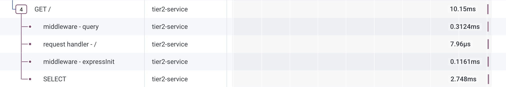

# Guide of instrumenting OTEL on Tier2 - Nodejs

Tier 2 is written in [Node.js](https://nodejs.org/en), and uses [Express](https://expressjs.com/) as web framework, and also uses [mysql2](https://www.npmjs.com/package/mysql2) to connect to mysql database, and [winston](https://www.npmjs.com/package/winston) for logging.

## Integration Strategy

The quckest way to instrument Node.js would be to use the [auto-instrumentations-node](https://www.npmjs.com/package/@opentelemetry/auto-instrumentations-node) available in NPM.

## Instrumentation Steps

1. In [Dockerfile](Dockerfile), add the following entry to install opentelemetry's node auto-instrumentation.

```
RUN npm install --save @opentelemetry/auto-instrumentations-node
```

2. In the [package.json](package.json), add `--require @opentelemetry/auto-instrumentations-node/register` in the start-local and start script to initialize auto instrumentation library to be started when running the index.js.

```
{
  "name": "@otel-o11y-demo/tier2",
  "version": "1.0.0",
  "description": "",
  "main": "index.js",
  "scripts": {
    "start-local": "tsc && node --require @opentelemetry/auto-instrumentations-node/register src/index.js",
    "start": "node --require @opentelemetry/auto-instrumentations-node/register src/index.js"
  },
  "author": "",
  "license": "ISC",
  "dependencies": {
    "express": "^4.18.3",
    "mysql2": "3.11.0",
    "winston": "^3.13.1"
  },
  "devDependencies": {
    "@types/express": "^4.17.21",
    "typescript": "^5.4.2"
  }
}
```

3. In [docker-compose.yaml](../docker-compose.yaml), add the following environment variables to `tier1` so that OTEL auto-instrumentation would know the service name, OTLP exporting endpoint (where to send the traces to), and required API key to be part of OTLP headers for authenticating into it.

```
  tier2:
    build:
      context: ./tier2-nodejs
      dockerfile: Dockerfile
    image: tier2-nodejs:latest
    environment:
      - OTEL_SERVICE_NAME=tier2-service
      - OTEL_EXPORTER_OTLP_ENDPOINT=${OTEL_EXPORTER_OTLP_ENDPOINT}
      - OTEL_EXPORTER_OTLP_HEADERS=x-honeycomb-team=${HONEYCOMB_API_KEY}
    ports:
      - 8400:8080
    depends_on:
      db:
        condition: service_healthy
```

## What this would look like



You should see the service name `tier2-service` that contains GET entry point, middleware spans, request handler, and SELECT span that were captuerd by the auto-instrumentation library of OTEL.

## Further readings

- [OpenTelemetry Concepts](https://opentelemetry.io/docs/concepts/) : Get yourself familiarized with various concepts of OpenTelemetry.
