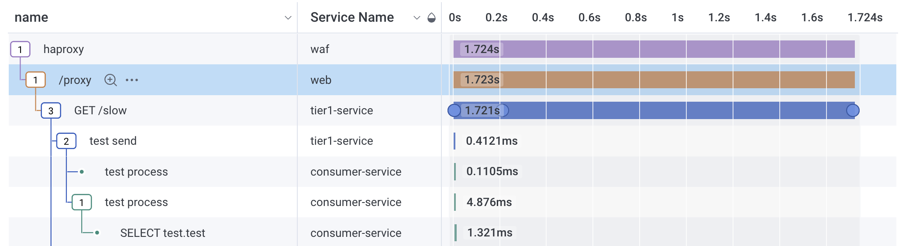

# Guide of instrumenting OTEL on WEB layer

WEB layer is run using [NGINX](https://nginx.org/en/) and its purpose is to provide the front end web layer composed of HTML pages, and javascript libraries to render and interfact with the user. WEB layer also acts as proxy for backend services, forwarding requests to Tier 1 service as necessary.

## Integration Strategy

NGINX has the ability to be configured with an opentelemetry module that can be downloaded and configured with it. Detailed instructions are found in opentelemetry's website [here](https://github.com/nginxinc/nginx-otel/blob/main/README.md).

In addition to the NGINX's opentelemetry module, Honeycomb's new HFO (Honeycomb Frontend Observability) is also instrumented which captures web browser specific traces such as document load, LCP, user interaction events, and web resource fetch.

## Instrumentation Steps

1. In the [nginx.conf](nginx.conf), add the following code which will load the `ngx_otel_module.so`, and configure it to start emitting traces on two http endpoints. Also, we are loading `ngx-http-js_module.so` which will be used to detect and process traceparent (W3C trace context) to be populated in index.html, so that web sdk will be able to connect the document related traces to it.

```
load_module modules/ngx_otel_module.so;
load_module modules/ngx_http_js_module.so;
events {}
http {
  js_import http_js.js;
  otel_exporter {
    endpoint otel-collector:4317;
  }
  otel_trace on;
  otel_service_name web;
  log_format main '$remote_addr'
                  '\t$remote_user'
                  '\t$time_local'
                  '\t$request'
                  '\t$status'
                  '\t$headers_json';
  include       mime.types;
  default_type  application/octet-stream;
  js_set $headers_json http_js.headers_json;

  server {
    listen 80;
    listen [::]:80;
    server_name localhost;
    access_log /var/log/nginx/access.log main;
    error_log /var/log/nginx/error.log debug;

    location = / {
      js_body_filter http_js.renderTemplate;
      otel_trace_context propagate;
      root /usr/share/nginx/html;
      try_files /index.html =404;
    }

    location ~ .(html|htm)$ {
      js_body_filter http_js.renderTemplate;
      otel_trace_context propagate;
      root /usr/share/nginx/html;
    }

    location / {
      otel_trace_context propagate;
      root /usr/share/nginx/html;
    }

    location /proxy {
      otel_trace_context propagate;
      proxy_pass http://tier1:8080/;
    }

    error_page 500 502 503 504 /50x.html;
    location = /50x.html {
      root /usr/share/nginx/html;
    }
  }
}
```

* Note al the configurations that are prefixed with `otel_`. Those are the otel specific configurations.

These are the configuration options for enabling the module, setting the exporter protocol, and specifying otel-collector as the OTLP endpoint, and etc.

2. In the [Dockerfile](Dockerfile), notice how some extra modules (nginx-module-otel and nginx-module-njs) were installed, as well as additional *.js files that will
be used to render html page's traceparent, as well as emit otel web specific traces (otelweb.js). The otelweb.js script was developed using [web sdk for browser](https://opentelemetry.io/docs/languages/js/getting-started/browser/) documentation and [Honeycomb for frontend](https://docs.honeycomb.io/get-started/start-building/web/) documentation.

```
FROM docker.io/library/nginx:1.26.1
RUN apt-get update
RUN apt-get install -y curl gnupg2 ca-certificates lsb-release debian-archive-keyring
RUN curl https://nginx.org/keys/nginx_signing.key | gpg --dearmor | tee /usr/share/keyrings/nginx-archive-keyring.gpg >/dev/null
RUN echo "deb [signed-by=/usr/share/keyrings/nginx-archive-keyring.gpg] http://nginx.org/packages/debian `lsb_release -cs` nginx" | tee /etc/apt/sources.list.d/nginx.list
RUN echo "Package: *\nPin: origin nginx.org\nPin: release o=nginx\nPin-Priority: 900\n" | tee /etc/apt/preferences.d/99nginx
RUN apt-get update
RUN apt-get install -y nginx
RUN apt-get install -y nginx-module-otel
RUN apt-get install -y nginx-module-njs
COPY static/index.html /usr/share/nginx/html/index.html
COPY static/index.js /usr/share/nginx/html/index.js
COPY static/otelweb.js /usr/share/nginx/html/otelweb.js
COPY static/loading-meme.gif /usr/share/nginx/html/loading-meme.gif
COPY static/otel-o11y-demo.png /usr/share/nginx/html/otel-o11y-demo.png
COPY nginx.conf /etc/nginx/nginx.conf
COPY static/http_js.js /etc/nginx/http_js.js
```

* The above script is necessary to register the nginx repo, and installing necessary nginx and nginx-module-otel to the container.
* Also, the module seems to have dependency with nginx:1.26.1

3. **http_js.js** and **otelweb.js**

Copy the following files into [./static](./static) directory:

- [http_js.js](https://github.com/honeycombio/otel-o11y-demo/blob/custom-instrumented/web/static/http_js.js): used to render traceparent meta tag inside [index.html](static/index.html) with the propagated traceparent value, if exists.
- [otelweb.js](https://github.com/honeycombio/otel-o11y-demo/blob/custom-instrumented/web/static/otelweb.js): built and bundled frontend package containing instrumentation codes and exporters to emit trace to Honeycomb endpoint.

4. modify otelweb.js
- Open `otelweb.js` and scroll to the end of the file. By default, the web sdk is configured to send its web traces into the opentelemetry collector which would be running on the localhost as part of the docker compose. You may be able to change that if you wish to send it to any external opentelemetry collector.

```
    debug: true,
    endpoint: "http://localhost:24318/v1/traces",
    skipOptionsValidation: true,
    serviceName: "web-sdk",
```

5. modify index.html
- Open [index.html](static/index.html) and add the `traceparent` meta tag in the header section.

```html
<head>
    <meta charset="UTF-8">
    <meta name="viewport" content="width=device-width, initial-scale=1.0">
    <meta name="traceparent" content="00-00000000000000000000000000000000-0000000000000000-00">
    <title>OTEL o11y demo</title>
```

Also, at the end of the body, add the `<script type="module" src="otelweb.js"></script>` to include the web sdk to be loaded.

```
    <script type="text/javascript" src="index.js"></script>
    <script type="module" src="otelweb.js"></script>
```

## What this would look like



You should see the service name `web` that bridges the trace between `waf` and `tier-service` calling `/proxy` and eventually calling `/slow` in tier1-service.


Dataset `web-sdk` is also going to show how a particular page request had web resources (pages, images, etc) loaded that can give you insights on how efficient your page is being loaded.


Various web vitals and user interactions can also be captured (e.g. mouse clicks) which can add depth to your real user monitoring.

## Further readings

- [OpenTelemetry Concepts](https://opentelemetry.io/docs/concepts/) : Get yourself familiarized with various concepts of OpenTelemetry.